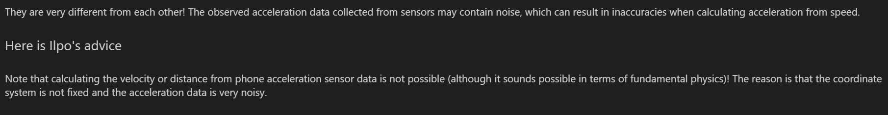

# Physics Final Project: Sports App Demo

## Introduction
This Jupyter Notebook presents an analysis of acceleration and GPS coordinate data collected during a walk. The notebook calculates various metrics and visualizes them using diagrams and numerical outputs.

## Calculations and Visualizations

### Map of Movement (Folium)
The notebook generates a map showing the movement path during the walk using Folium.

### Distance Graph
A graph is plotted to visualize the distance traveled during the walk. The distance is calculated from the GPS coordinates and increases from zero.

### Velocity Graph
A graph is plotted to visualize the velocity during the walk. Velocity is calculated from the GPS coordinates.

### Acceleration Graph
Four acceleration graphs are presented:

1.　 Calculated acceleration: The acceleration calculated from the velocity data, consisting of one component.

2.　Observed acceleration: The acceleration data collected during the walk, consisting of three components (x, y, z).

### Average Speed
The notebook calculates the average speed during the walk and presents it as a numerical output.

### Traveled Distance
The total distance traveled during the walk is calculated and presented as a numerical output.

### Number of Steps
The number of steps taken during the walk is calculated and presented as a numerical output.

## Discussion

### Acceleration Analysis
The acceleration calculated from the speed and the observed acceleration may exhibit differences. These differences could be attributed to several factors, including noise in the acceleration data, inaccuracies in the GPS coordinates, and limitations in the method used for calculating acceleration from velocity.

### Logical Number of Steps
The calculated number of steps is evaluated for logical consistency based on the total distance traveled and the average step length expected for an adult male. The reasoning behind the evaluation is provided in the notebook.

## Conclusion
This Jupyter Notebook provides a comprehensive analysis of the acceleration and GPS coordinate data collected during the walk. It offers insights into the movement patterns and performance metrics, along with discussions on the observed differences and logical implications of the results.

